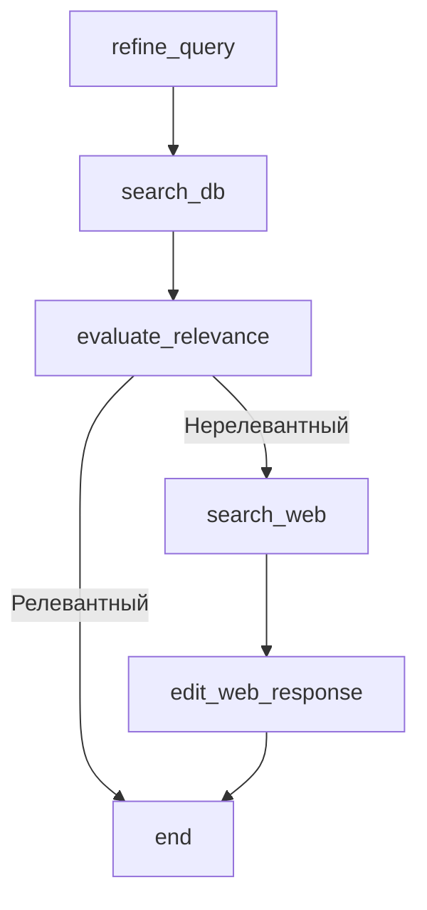

# ReadMe
### Описание

Данный проект представляет собой консольное приложение чат-бот для ответа на вопросы из базы знаний на основе агентского RAG подхода.

### Библиотеки

- SentenceTransformers 
- LangChain
- Pandas 
- ChromaDB 
- DuckDuckGoSearchRun 
- LangGraph
- Python 3.9

### Основной функционал

1. Уточнение запросов

Агент анализирует текущий запрос пользователя в контексте истории предыдущих вопросов и ответов. Если запрос недостаточно конкретен, система уточняет его.

Пример работы:

- История: "Кактусам подойдут удобрения с высоким содержанием калия."
- Запрос: "А сколько раз поливать?"
- Уточнённый запрос: "Сколько раз поливать кактусы?"

2. Поиск в базе данных

Уточнённый запрос используется для поиска в базе данных.

3. Оценка релевантности

Система проверяет, можно ли считать найденные в базе данных результаты релевантными запросу пользователя. Например, она сравнивает:

- Запрос пользователя: "Какое удобрение подойдёт кактусам?"
- Вопрос из базы данных: "Какие удобрения лучше для суккулентов?"

Если результаты нерелевантны, система инициирует поиск в интернете.

4. Поиск в интернете

Система использует DuckDuckGo для поиска ответов в интернете, когда данные из базы недостаточны или нерелевантны.

5. Редактирование ответа из интернета

Полученные данные из интернета редактируются для улучшения их читабельности и соответствия запросу пользователя.

### Итоговый граф:
 


#### Узлы графа 

- refine_query - уточнение запроса.
- search_db - поиск в базе данных.
- evaluate_relevance - оценка релевантности найденных результатов.
- search_web - поиск в интернете.
- edit_web_response - редактирование ответа из интернета.

#### Переходы

- После уточнения запроса происходит поиск в базе данных.
- Если найденные результаты релевантны, выполнение завершается.
- Если результаты нерелевантны, система ищет информацию в интернете и редактирует найденный ответ.

## Эксперименты
### Выбор модели

#### LLama 3.2 3b

Модель продемонстрировала низкое качество результатов: 

- При запросе "Какое удобрение подойдёт кактусам?" и "Какое растение перерабатывают в текилу?" LLama считала вопросы одинаковыми, следовательно неверно давала оценку релевантности.
- При редактировании интернет-ответов модель часто вставляла пустые символы, транслит.

#### Mistral 8b

Модель Mistral 8b показала значительно лучшие результаты:

При сравнении на одинаковых запросах и истории:
- C куда большей точностью справляется с задачами уточнения запросов и оценки релевантности.
- Выдаёт намного более качественные ответы ответы.

### Выбор эмбеддера
В сравнении учавствовали следующий эмбеддеры:
```python 
embedder_light = SentenceTransformer("paraphrase-multilingual-MiniLM-L12-v2")
embedder_heavy = SentenceTransformer("paraphrase-multilingual-mpnet-base-v2")
```

На удивление себя куда лучше показал embedder_light.
Пример поиска по бд при помощи тяжёлого эмбеддера:
- Запрос: Кто автор Хижина дяди Тома?
- Ответ (Сопоставленый вопрос и ответ на него):
 - Кем был Риголетто при дворе короля?
 - Шут

Что совсем не похоже на правду.

# Конечный пример работы:

loading...
Чат-бот готов к работе! Введите 'exit' для завершения.
- Вы: `Что любит Тютчев в начале мая?`
- Отредактированый вопрос: `Тютчев, месяц мая и что именно в этом времени он любит?`
- Бот: `По поиску в RuBQ Ответ: грозу`

---

- Вы: `По какой шкале измеряют землетрясения?` 
- Отредактированый вопрос: `Какова шкала измерений землетрясений?`
- Бот: `По поиску в RuBQ Ответ: По шкале Рихтера`

---

- Вы: `Что такое кактус?`
- Отредактированый вопрос: `Какой вид растения называется кактус?`
- Бот: `По поиску в DuckDuckGo: Какой самый крупный вид кактуса носит название Cereus giganteus, также известный как калифорнийский гигант. Вид Cereus giganteus установлен в Книге рекордов Гиннесса за свою колоссальную высоту, превышающую 25 метров. Кактусы растут лучше всего в жарком климате и малообеспеченной водой среде. Они отлично переносят жару и не имеют проблем содержания зимой, так как они приспособлены к выживанию в суровых условиях пустынь и степей. Кактусы — это растения семейства алоэ, агавы и опунции, которые отличаются своими впечатляющими способностями выживания под тяжелыми климатическими условиями. Ореол — основная отличительная черта кактусов, который может быть и на цветках. Кактусы требуют определенного внешнего вида и ухода для их сохранения.`

---

- Вы: `а как часто надо их поливать?`
- Отредактированый вопрос: `Сколько раз нужно поливать кактусы?`
- Бот: `По поиску в DuckDuckGo:  Через сколько раз нужно поливать кактусы?
   Рекомендация: Поливайте кактус в квартире или доме раз в неделю, если он выращивается в маленьком горшке. Если же ваше растение имеет большое количество почвы, поливайте его раз в 4-6 недель. Это справедливо для большей части кактусов, которые требуют редкого полива.
   В зависимости от времени года и природных условий может потребоваться изменение частоты поливания. Например, в жарких и сухих климатах вам могут понадобиться две-три недели для следующего полива.
   В зимний период достаточно поливать кактус один раз в 2-3 недели, а весной - раз в 10 дней. Эта информация приведена флористом и рекомендована для сохранения здоровья растения.`
